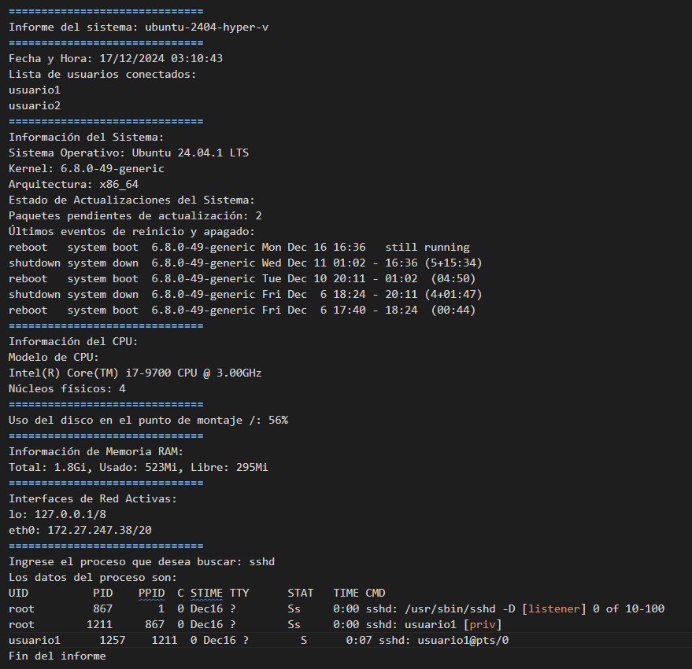
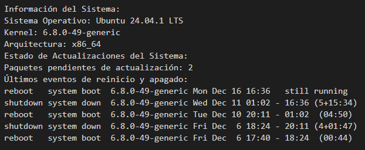

# Script de Información de Sistema para Linux

## Descripción General
Este script de bash genera un reporte detallado del sistema. Incluye información sobre el hardware, los procesos, la red y los recursos del sistema.

## Prerrequisitos
- Sistema operativo basado en Linux
- Shell de Bash

## Comandos para ejecutar el script
Establecer permisos de ejecución:

```bash
sudo chmod +x informe_del_sistema.sh
```
Verificar permisos:

```bash
ls -l informe_del_sistema.sh
```
Debería mostrar:

```bash
 -rwxr-xr-x
```
## Uso del comando "set -euo pipefail"

El comando "set -euo pipefail" en el script de Bash se utiliza para mejorar la robustez del script y el manejo de errores. 
A continuación, se muestra un desglose de lo que hace cada opción:

- set -e

Propósito: salir inmediatamente del script si un comando presenta un "exit code" distinto de cero.

Uso: esto ayuda a detectar errores al principio del script, lo que evita que el script continúe su ejecución con datos potencialmente incorrectos.

- set -u

Propósito: tratar las variables no definidas como un error al sustituir.

Uso: esto garantiza que todas las variables se definan antes de que se utilicen, lo que ayuda a evitar errores causados ​​por errores tipográficos o variables faltantes.

- set -o pipefail

Propósito: el valor de retorno de un pipeline es el estado del último comando que salió con un estado distinto de cero, o cero si ningún comando salió con un estado distinto de cero.

Uso: esto garantiza que se detecten los errores en cualquier parte de un pipeline, en lugar de solo el comando final en el pipeline.

## Uso básico del script

Ejecutar el informe completo del sistema (sin parámetros ni argumentos):

```bash
./informe_del_sistema.sh
```

## Ejecutar funciones específicas

El script soporta la ejecución individual de funciones:

- ./informe_del_sistema.sh encabezado    # Muestra el encabezado con el nombre del host
- ./informe_del_sistema.sh fecha_hora    # Muestra la fecha y la hora del sistema
- ./informe_del_sistema.sh usuarios      # Muestra los usuarios conectados
- ./informe_del_sistema.sh info          # Muestra la información general del sistema operativo
- ./informe_del_sistema.sh cpu           # Muestra la información del CPU
- ./informe_del_sistema.sh disco         # Muestra el uso del disco (ver aparte)
- ./informe_del_sistema.sh ram           # Muestra información de la memoria RAM
- ./informe_del_sistema.sh red           # Muestra información de las placas de red
- ./informe_del_sistema.sh proceso       # Pide ingresar el nombre de un proceso específico y lo busca

## Chequear el uso de disco para un punto de montaje específico

```bash
./informe_del_sistema.sh disco "/home"   # Chequea el uso de disco para "/home"
```

## Resolución de problemas

Permiso denegado: Si obtiene una salida de "permiso denegado" ejecute:

```bash
sudo chmod +x informe_del_sistema.sh
```

Comando no encontrado. Asegurarse de estar ubicado en el directorio correcto:

```bash
cd /ruta/al/directorio/del/script
```
O usar la ruta completa:
```bash
./ruta/al/script/informe_del_sistema.sh
```

## Ejemplos de ejecución

El script genera una salida en el siguiente formato para el informe completo:

```bash
$ ./informe_del_sistema.sh
```



Ejecutando el script con el parámetro "info":

```bash
$ ./informe_del_sistema.sh info
```
Se genera una salida con el siguiente formato:



## Consideraciones de seguridad

El script requiere ciertos comandos del sistema que pueden necesitar privilegios de root.
Algunas funciones pueden exponer información confidencial del sistema.
Considere restringir los permisos de ejecución del script a usuarios autorizados.
Revise el código antes de ejecutarlo con privilegios elevados.

## Mantenimiento

Para mantener el script funcionando correctamente actualice periódicamente los paquetes del sistema. Verifique las dependencias necesarias. Verifique los permisos de archivo. Pruebe primero en sistemas que no sean de producción.

## Contribuciones

Realizar un fork el repositorio. Crear una rama. Realizar los cambios. Enviar un pull request.


Este README proporciona:
- Instrucciones de ejecución
- Ejemplos de uso
- Pasos para la solución de problemas
- Consideraciones de seguridad
- Pautas de mantenimiento
- Instrucciones de contribución
